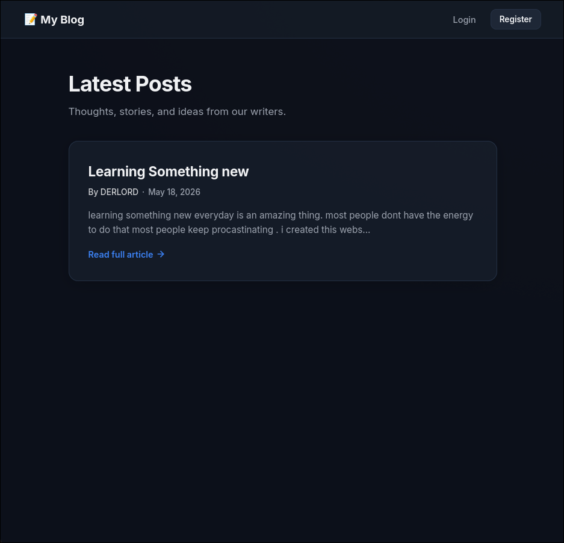

# 📝 Simple Personal Blog

A lightweight, modern personal blog engine built with **Python** and **Flask**, featuring a secure user authentication system and content management dashboard.

---

## 🚀 Features

- **Secure Authentication:** User registration, login, and session tracking using secure password hashing.
- **Personal Dashboard:** An elegant control panel to view, manage, and delete your posts.
- **Content Editor:** Clean layout for drafting and publishing articles.
- **Premium Dark UI:** Modern, distraction-free aesthetic matching premium software platforms.

---

## 🛠️ Tech Stack

- **Backend:** Flask (Python)
- **Database:** SQLite + Flask-SQLAlchemy
- **Auth:** Flask-Login + Werkzeug password hashing
- **Templates:** Jinja2
- **Styling:** Vanilla CSS (Grid & Flexbox)

---

## 📸 Screenshot



---

## 📦 Installation

```bash
git clone https://github.com/Gaurab-Kunwar/Personal-Blog
cd Personal-Blog

# Windows
python -m venv venv
.\venv\Scripts\activate

# macOS / Linux
python3 -m venv venv
source venv/bin/activate

# Install dependencies
pip install flask flask-sqlalchemy flask-login werkzeug

# Run the app
python app.py
```

Visit `http://127.0.0.1:5000` in your browser.

---

## 🔮 Planned Features

- AI writing assistant (Claude API integration)
- Edit post functionality
- Post categories and tags

---
